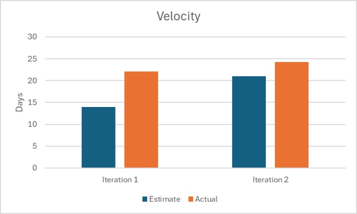

# Retrospective

## Discussion

Overall, Spenditure was successful. Despite encountering numerous technical and communication problems we eventually managed to overcome them and successfully deliver a project that we can be proud of. Looking back, there are some aspects of communication, time management, and branch management that could have been done better. 

### Communication

Slow communication meant that changes that should have only taken a few minutes got dragged out into days. Questions arose over design choices and what an interface would look like. In particular, this signifigantly slowed UI development as they relied upon logic layer interfaces to fully test their components. What we specifically want to improve in iteration 3 was to provide greater clarity upfront on what interfaces would look like so people working on the logic and UI aspects of the project would not have to wait to get answers and fixes to simple design problems.

So, our strategy for addressing this is to have a meeting early in iteration 3 where we decide what each of our interfaces for all our new classes will look like then adhere to this design as much as possible. This should solve this issue by frontloading the design choices and avoiding last minute communication about changes to design. 

We will measure our success by committing to having a finalized document detailing all our iteration 3 changes within the first 4 days of iteration 3 and having fewer than 2 disagreements about design choices during iteration 3 (design choices being things like "I think a function should return x instead of y" and not bug fixes)

### Time Management

In iteration 2 we suffered from a lack of clarity over when things should be done by. At the beginning of the iteration we never set any concrete deadlines for specific features or tasks to be completed so that lead to a great deal of confusion over when things would be ready for testing; for example, setting up the database took almost a week longer than expected. This was especially bad for all the testing required for iteration 2 as it could not be started until everything else was done, leading to it being done last minute.

We intend to address this problem by determing the tasks early on and setting a hard deadline for each one, any group member who fails to meet the deadline will be mercilessly shamed in the groupchat.

We will consider this solution successfully implemented if we have a list of tasks and a deadline for each of them compiled within the first 4 days of iteration 3 (at our first meeting) and everything code related for iteration 3 gets finished at least 3 days before the deadline.

### Branch Management

Multiple times in iteration 1 and 2 someone would pull a change from another branch only to find out that it doesn't work with their current code, leading to numerous merge conflicts and delays; moreover, it was unclear what branch other people were working on leading to confusion over progress in other areas. This caused a great deal of time loss as people tried to fix things that were already fixed in other branches or created new features that relied on outdated code. 

We intend to address this problem by creating a document that lists what branch each person is working on and which branch is the most up to date. This document can serve as a reference point for people curious about progress on other features and ensure that everyone can test their code with the most up to date branch. 

We will consider this solution successful if this branch document is created within 4 days of iteration 3 starting and we experience less merge conflicts than in iteration 2.

## Project Velocity

